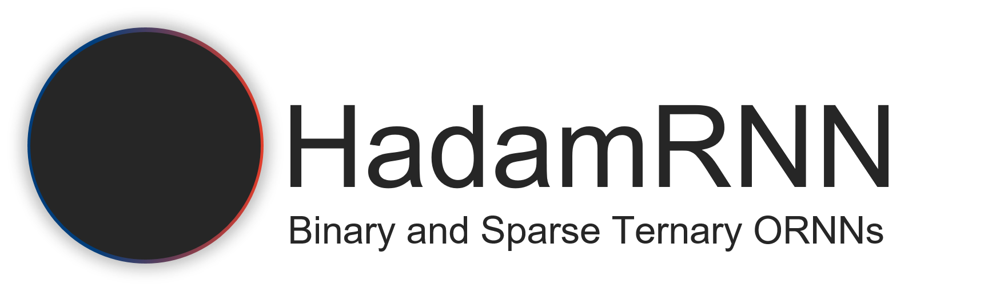

# HadaRNN binary and ternary and orthogonal Recurrent Neural Networks

Welcome to the repository for our submission **HadamRNN: Binary and Sparse Ternary Orthogonal RNNs**, accepted at the conference [ICLR'25](https://iclr.cc/).

This repository contains code and resources to build binary or ternary orthogonal RNNs, and run the experiments presented in the paper..

<!-- Banner section -->
<div align="center">
        <picture>
                <source media="(prefers-color-scheme: dark)" srcset="./docs/assets/banner_dark.png">
                <source media="(prefers-color-scheme: light)" srcset="./docs/assets/banner_light.png">
                
        </picture>
</div>
<br>

<!-- Badge section -->
<div align="center">
    <a href="#">
        
    </a>
    <a href="#">
        
    </a>
</div>
<br>

<!-- Short description of your library -->
<p align="center">
  <b>HadaRNN</b> is a Python toolkit dedicated to binary and ternary and orthogonal Recurrent Neural Networks.

  [//]: # "<!-- Link to the documentation -->"
  [//]: # "%<br>"
  [//]: # "<a href="https://www.youtube.com/watch?v=dQw4w9WgXcQ"><strong>Explore Libname docs »</strong></a>"
  [//]: # "<br>"

</p>

## 📚 Table of contents

- [📚 Table of contents](#-table-of-contents)
- [🚀 Overview](#-overview)
- [📦 What's Included](#-whats-included)
- [👀 See Also](#-see-also)
- [🙏 Acknowledgments](#-acknowledgments)
- [👨‍🎓 Creator](#-creator)
- [🗞️ Citation](#-citation)
- [📝 License](#-license)


[//]: # "- [🔥 Tutorials](#-tutorials)"
[//]: # "- [👍 Contributing](#-contributing)"
[//]: # "## 🔥 Tutorials"
[//]: # "We propose some tutorials to get familiar with the library and its API:"
[//]: # "- [Getting started](https://colab.research.google.com/drive/1XproaVxXjO9nrBSyyy7BuKJ1vy21iHs2) <sub> [](https://colab.research.google.com/github/deel-ai/<libname>/blob/master/docs/notebooks/demo_fake.ipynb) </sub>"


## 🚀 Overview

This code require uses the pytorch framework, and the [deel-torchlip](https://github.com/deel-ai/deel-torchlip). [Other dependencies](#installation)

### Installation

1. **Clone the repository**:

   ```bash
   git clone https://github.com/deel-ai-papers/hadamRNN.git
   cd hadamRNN
   ```
   
2. **Create a virtual environment** (optional but recommended):

   ```bash
   python -m venv venv
   source venv/bin/activate  # On Windows use `venv\Scripts\activate`
   ```

3. **Install dependencies**:

   ```bash
   pip install -r requirements.txt
   ```
  See also config/<expe>/Readme.md files for additional dependencies for expes

### Launch experiments

To train a model, use the `train.py` script located in the `src/` directory.

```bash
python src/train.py --help

usage: train.py [-h] [--config CONFIG]

options:
  -h, --help       Show this help message and exit.
  --config CONFIG  Path to the configuration file.
```

#### Example Command

```bash
python src/train.py --config config/pmnist/pmnist_hadamRNN_paper.yaml
```

This command trains a model using the configuration specified in `config/pmnist/pmnist_hadamRNN_paper.yaml`.

## 📦 What's Included


### Repository Structure

```plaintext
.
├── config # all configuration are here by sub-directories
│   └── pmnist/pmnist_hadamRNN_paper.yaml
│   └── smnist/smnist_hadamRNN_paper.yaml
│   └── copytask/copy_task_hadamRNN_paper.yaml
│   └── imdb/imdb_hadamRNN_paper.yaml
│   └── glue/sst2_hadamRNN_paper.yaml
│   └── glue/qqp_hadamRNN_paper.yaml
├── README.md
├── requirements.txt
└── src # all code is here
    ├── launch_train.py
    ├── config.py # yaml config load
    ├── getters.py # from config to classes
    ├── quantized_layers.py # hadamard and quantized layers
    ├── training.py # training and validation steps
    ├── utils.py 
    ├── dataset_tools # folder for dataset management
    ├── extra_layers.py # layers for post training quantization of activations
    ├── notebook/expe_quantif_activ_hadam.ipynb # post training quantization of activations


```

- **configs/**: Configuration files for training models.
- **requirements.txt**: Python dependencies.
- **src/**: Source code directory.
  - **launch_train.py**: Main script for  training
  - **training.py**: Training script.

## 👍 Contributing

We welcome contributions to improve this repository. Please submit a pull request or open an issue to discuss your proposed changes.

## 👀 See Also

This library is one approach of many...

Other tools to proposed by the [DEEL](www.deel.ai) project:

- [Xplique](https://github.com/deel-ai/xplique) a Python library exclusively dedicated to explaining neural networks.
- [deel-lip](https://github.com/deel-ai/deel-lip) a Python library for training k-Lipschitz neural networks on TF and Keras3.
- [Influenciae](https://github.com/deel-ai/influenciae) Python toolkit dedicated to computing influence values for the discovery of potentially problematic samples in a dataset.
- [deel-torchlip](https://github.com/deel-ai/deel-torchlip) a Python library for training k-Lipschitz neural networks on PyTorch.
- [oodeel](https://github.com/deel-ai/oodeel) a Python library for post-hoc deep OOD (Out-of-Distribution) detection on already trained neural network image classifiers
- [DEEL White paper](https://arxiv.org/abs/2103.10529) a summary of the DEEL team on the challenges of certifiable AI and the role of data quality, representativity and explainability for this purpose.

## 🙏 Acknowledgments

<div align="right">
  <picture>
    <source media="(prefers-color-scheme: dark)" srcset="https://share.deel.ai/apps/theming/image/logo?useSvg=1&v=10"  width="25%" align="right">
    <source media="(prefers-color-scheme: light)" srcset="https://www.deel.ai/wp-content/uploads/2021/05/logo-DEEL.png"  width="25%" align="right">
    
  </picture>
</div>
This project received funding from the French ”Investing for the Future – PIA3” program within the Artificial and Natural Intelligence Toulouse Institute (ANITI). The authors gratefully acknowledge the support of the <a href="https://www.deel.ai/"> DEEL </a> project. A. Foucault was supported by
‘Région Occitanie, France’, which provided a PhD grant. Part of this work was performed using HPC
resources from CALMIP (Grant 2024-P22034).

## 👨‍🎓 Creators

This code was created by Franck Mamalet and Armand Foucault.

## 🗞️ Citation

If you use code as part of your workflow in a scientific publication, please consider citing 🗞️ [our paper](https://arxiv.org/abs/2502.00047):

```
@inproceedings{
foucault2025hadamrnn,
title={{HADAMRNN}: {BINARY} {AND} {SPARSE} {TERNARY} {ORTHOGONAL} {RNNS}},
author={Armand Foucault and Francois Malgouyres and Franck Mamalet},
booktitle={The Thirteenth International Conference on Learning Representations},
year={2025},
}
```

## 📝 License

The package is released under [MIT license](LICENSE).
